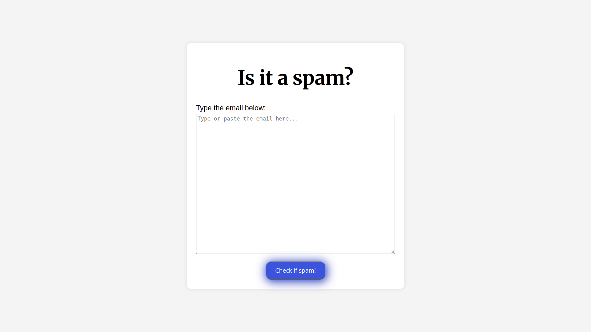

# Spam Email Classifier

An ML-powered REST API that detects whether a message is **spam** or **ham**, paired with a simple web interface. Built with Django REST Framework and a scikit-learn model.

## Live Demo

- **API:** `https://spam-email-detector-1-843g.onrender.com/api/predict/`
- **Frontend:** hosted on GitHub Pages (see links in the repo description)



## Features

- Classify any message as `spam` or `ham` in a single POST request
- Text vectorization with **TF-IDF** and classification with **Logistic Regression**
- Model & vectorizer loaded once at app startup for fast responses
- Simple, responsive static web interface
- CORS-enabled for cross-origin consumption

## Tech Stack

- **Backend:** Django 5 · Django REST Framework · django-cors-headers
- **Machine Learning:** scikit-learn (LogisticRegression, TfidfVectorizer) · pandas · joblib
- **Frontend:** HTML / CSS / vanilla JavaScript (hosted on GitHub Pages)
- **Deployment:** Render (API) · GitHub Pages (frontend)

## Project Structure

```
spam-email-classifier/
├── api/                      # Django app exposing the prediction API
│   ├── apps.py               # Loads model + vectorizer at startup
│   ├── urls.py               # /api/predict/ route
│   ├── views.py              # PredictView API endpoint
│   └── migrations/
├── spam_project/             # Django project configuration (settings, urls, wsgi...)
├── model/
│   ├── dataset/spam.csv      # Training dataset
│   ├── spam_detector_model.joblib   # Serialized classifier
│   └── tfidf_vectorizer.joblib      # Serialized vectorizer
├── scripts/main.js           # Frontend JS (posts to the API)
├── styles/main.css           # Frontend styles
├── index.html                # Frontend page
├── train_model.py            # Trains and saves the model + vectorizer
└── requirements.txt          # Python dependencies
```

## How It Works

1. `train_model.py` trains a Logistic Regression classifier on TF-IDF text features and saves the model and vectorizer as `.joblib` files.
2. `api/apps.py` loads both files into memory when the Django app starts.
3. Requests to `/api/predict/` are transformed with the same vectorizer and passed to the model, which returns `spam` or `ham`.

## Getting Started

### Prerequisites

- Python 3.8+

### Setup

```bash
# 1. Clone the repository
git clone git@github.com:SandeepKumarKuanar/Spam-email-detector.git
cd spam-email-classifier

# 2. Create and activate a virtual environment
python -m venv venv
source venv/bin/activate   # Windows: venv\Scripts\activate

# 3. Install dependencies
pip install -r requirements.txt

# 4. Retrain the model (optional, only if you changed the dataset)
python train_model.py

# 5. Run the development server
python manage.py runserver
```

### Configuration / Environment Variables

For a secure production setup, configure the following via environment variables instead of hardcoding them in `spam_project/settings.py`:

| Variable        | Description                                            |
|-----------------|--------------------------------------------------------|
| `SECRET_KEY`    | Django secret key (unique, keep private)               |
| `DEBUG`         | Set to `False` in production                           |
| `DJANGO_ALLOWED_HOSTS` | Comma-separated list of allowed hostnames         |
| `CORS_ALLOWED_ORIGINS` | Comma-separated list of allowed frontend origins |

Example `.env`:

```
SECRET_KEY=your-secret-key
DEBUG=False
DJANGO_ALLOWED_HOSTS=your-app.onrender.com,localhost,127.0.0.1
CORS_ALLOWED_ORIGINS=https://your-username.github.io
```

## Testing the API

Send a POST request with a `message` field:

```bash
curl -X POST https://spam-email-detector-1-843g.onrender.com/api/predict/ \
  -H "Content-Type: application/json" \
  -d '{"message": "Congratulations! You won a free iPhone. Click here to claim."}'
```

Response:

```json
{ "prediction": "spam" }
```

A plain message returns:

```json
{ "prediction": "ham" }
```

If no `message` is provided, the API returns a `400` error:

```json
{ "error": "Message not provided" }
```

## Training the Model

`train_model.py` reads `model/dataset/spam.csv` (an SMS spam/ham dataset), splits the data 80/20, trains a Logistic Regression classifier on TF-IDF features, reports accuracy, and saves both the model and vectorizer:

```bash
python train_model.py
```

You should see output similar to:

```
Model Accuracy on Test Data: 0.962772
Model and vectorizer have been saved to the 'model' directory.
```

## Deployment

### Render (API)

- **Build:** `pip install -r requirements.txt`
- **Start command:** `gunicorn spam_project.wsgi:application`
- Set the environment variables listed above in the Render dashboard.
- Add your Render domain to `DJANGO_ALLOWED_HOSTS`.

### GitHub Pages (Frontend)

- Static files (`index.html`, `styles/`, `scripts/`) can be served from a `gh-pages` branch or a Pages-enabled repo.
- Ensure your Pages origin is added to `CORS_ALLOWED_ORIGINS` so the browser can call the API.

## Roadmap

- Add automated tests for the prediction endpoint
- Harden configuration (move `SECRET_KEY`/`DEBUG` to environment variables, pin dependency versions)
- Add a `.gitignore` and stop tracking generated/model files
- Expand model evaluation and try alternative classifiers
- Add request logging and rate limiting

## Contact

- GitHub: [SandeepKumarKuanar](https://github.com/SandeepKumarKuanar)
- X: [@kuanar_sandeep](https://x.com/kuanar_sandeep)
- Email: kuanarsandeepkumar@gmail.com

## Credits

This project uses the **SMS Spam Collection** dataset for training the classification model.
